# How Does Gradient Descent Actually Work? Jeremy Cohen on the Edge of Stability

## TL;DR

In his invited talk at the [Sci4DL workshop (ICLR 2026)](../../raw/iclr-2026-workshop-sci4dl/README.md), Jeremy Cohen presented a compelling case that gradient descent in deep learning does *not* work the way classical optimization theory predicts. Rather than staying safely inside the "stable region" of weight space, gradient descent consistently leaves this region—and then steers itself back via a self-stabilizing negative feedback loop. Understanding this requires Taylor-expanding the loss to *third* order, revealing that oscillations along the sharpest direction automatically reduce the sharpness. Cohen argues this "edge of stability" phenomenon is not an edge case but the *typical* behavior of gradient descent in deep learning.

## Introduction

Why does gradient descent work in deep learning? This deceptively simple question has resisted satisfying answers for years. Classical optimization theory provides convergence guarantees for convex or smooth functions, but neural network loss landscapes are neither. The learning rates used in practice are often too large for the local curvature, yet training succeeds anyway.

Jeremy Cohen's talk at Sci4DL tackled this question head-on, presenting a research program that combines careful empirical observation with theoretical analysis—a prime example of the scientific method applied to deep learning that the workshop was designed to promote.

## Background: stability on quadratic objectives

Cohen began by reviewing what we know about gradient descent on simple quadratic functions. For a 1D quadratic $L(x) = \tfrac{1}{2} S x^{2}$ with curvature $S$, gradient descent with learning rate $\eta$ converges if and only if $S < 2/\eta$. When the curvature exceeds this threshold, iterates oscillate with exponentially growing amplitude—gradient descent diverges.

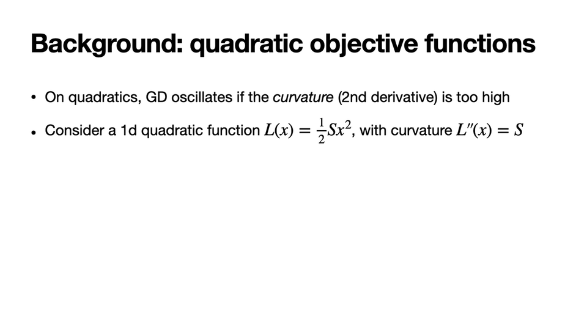

For deep learning objectives, one can take a local quadratic Taylor approximation around any point $w$ in weight space. The relevant quantity becomes the *sharpness*: the largest eigenvalue of the Hessian, $S(w) = \lambda_{\mathrm{max}}(H(w))$. The "stable region" is then the set of weights where $S(w) \leq 2/\eta$—the region where the local quadratic model predicts gradient descent will not oscillate.

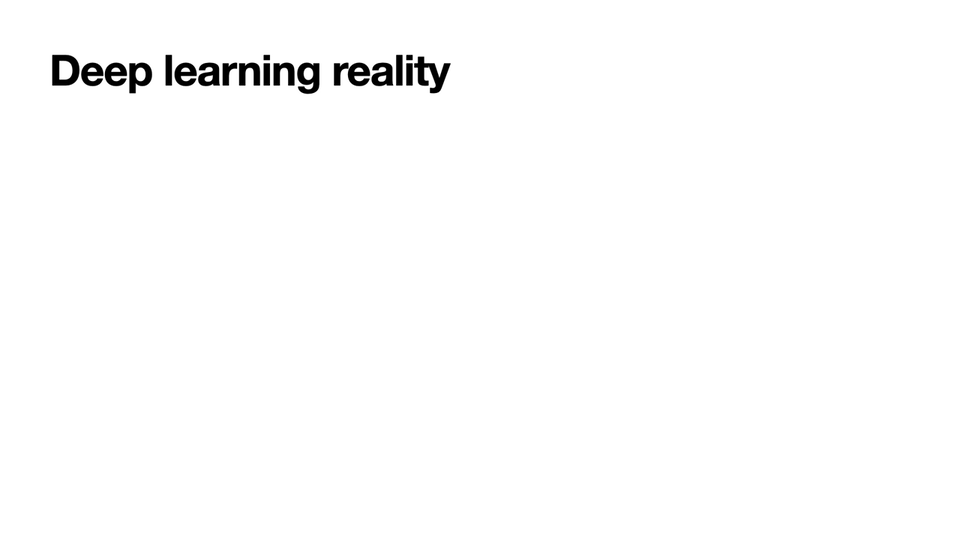

The natural expectation from classical theory is that gradient descent starts inside this stable region and remains there throughout training. As Cohen put it: this expectation is wrong.

## The empirical reality: training at the edge of stability

Cohen demonstrated what actually happens when training a Vision Transformer (ViT) on CIFAR-10 with full-batch gradient descent at learning rate $\eta = 0.02$. Two quantities are tracked: the training loss (left panel) and the top Hessian eigenvalue, i.e., the sharpness (right panel).

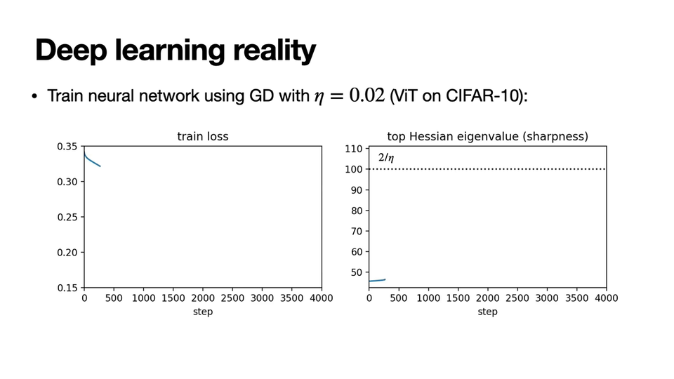

As training begins, the loss decreases and the sharpness increases—a robust empirical phenomenon that remains theoretically unexplained. At some point, the sharpness crosses the stability threshold $2/\eta$. At this point, classical theory predicts divergence.

To understand what happens next, Cohen zoomed into a short window of training around the critical moment. Three quantities are shown: the training loss, the sharpness, and the displacement along the top Hessian eigenvector (the direction predicted to be unstable).

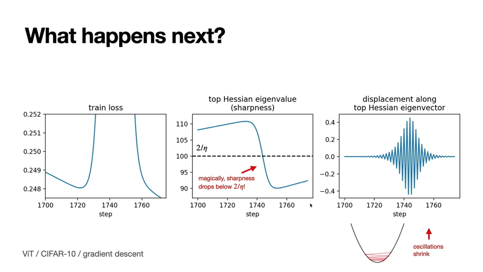

The sequence of events is striking:

1. **Oscillations begin**: Once sharpness exceeds $2/\eta$, the iterates start oscillating along the top eigenvector of the Hessian, exactly as the quadratic model predicts.
2. **Oscillations grow**: The oscillations grow exponentially, causing the training loss to spike upward.
3. **Sharpness drops**: Just when things look dire, the sharpness drops below $2/\eta$—seemingly "magically."
4. **Recovery**: With the sharpness back below the threshold, oscillations contract and the loss returns to its previous low value.

Cohen showed the full training trajectory: the sharpness rises to $2/\eta$ and then *equilibrates* around that value. The loss continues to decrease over the long run but exhibits non-monotonic short-term behavior. Training at a smaller learning rate ($\eta = 0.01$) produces the same pattern but with the sharpness equilibrating at the new, higher threshold $2/\eta = 200$.

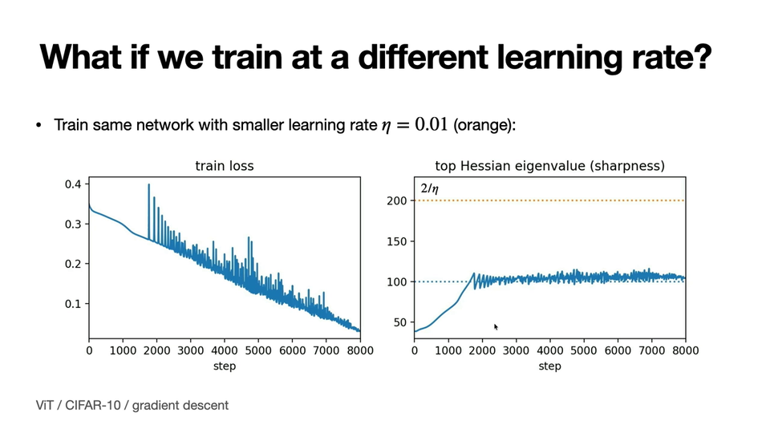

## Universality across architectures

A crucial point in Cohen's talk was that this is not a quirk of a particular architecture or dataset. He showed edge-of-stability behavior across:

**Image architectures** — CNN, ViT, and ResNet all exhibit the same pattern: sharpness rises to $2/\eta$ and equilibrates, while the loss decreases non-monotonically.

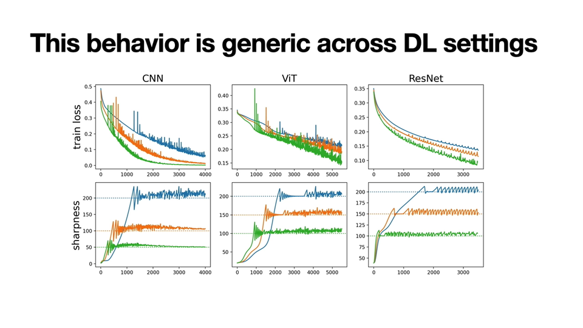

**Sequence architectures** — LSTM, Transformer, and Mamba show identical behavior on sequence tasks.

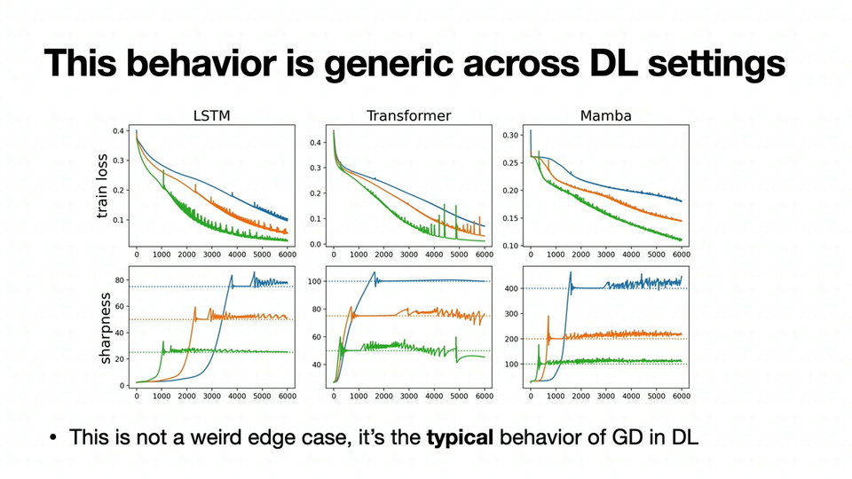

Cohen emphasized: "I'm not saying that if you set up things in this weird way, this is some weird edge case. Rather, I'm saying that this is the *typical* behavior of gradient descent in deep learning." He noted the caveat that this applies to full-batch gradient descent specifically—practical runs use SGD, Adam, or Muon—but the underlying dynamics are the same.

## The theoretical explanation: third-order Taylor expansion

The key theoretical insight, which Cohen attributed to a paper by Damian, Nichani, and Lee (*Self-stabilization: the implicit bias of gradient descent at the edge of stability*, ICLR 2023), is remarkably elegant:

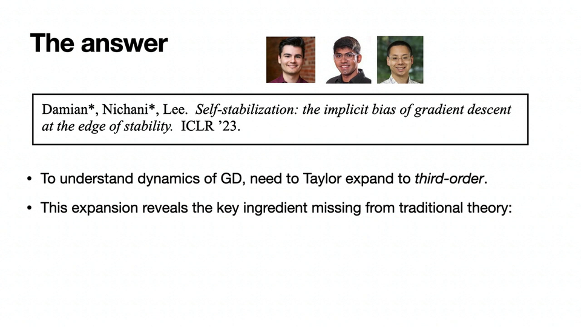

**To understand gradient descent dynamics in deep learning, you need to Taylor-expand the loss to one order higher than is normally used**—specifically, to third order.

Consider a point $w^{\ast} + x\mathbf{u}$, where $w^{\ast}$ is the position without oscillations, $\mathbf{u}$ is the top eigenvector of the Hessian, and $x$ is the oscillation magnitude. Taylor-expanding the gradient:

$$\nabla L(w^{\ast} + x\mathbf{u}) = \nabla L(w^{\ast}) + H(w^{\ast})[x\mathbf{u}] + \tfrac{1}{2} x^{2} \nabla S(w^{\ast}) + O(x^{3})$$

The terms have clear interpretations:
- **First term**: the gradient at the unperturbed point (drives normal optimization)
- **Second term**: $H(w^{\ast})[x\mathbf{u}]$ — since $\mathbf{u}$ is an eigenvector with eigenvalue $S$ (the sharpness), this simplifies to $Sx\mathbf{u}$, which is the term causing oscillations
- **Third term**: $\tfrac{1}{2} x^{2} \nabla S(w^{\ast})$ — **the gradient of the sharpness itself**

This third term is the key. When gradient descent takes a negative gradient step at $w^{\ast} + x\mathbf{u}$, it automatically performs a negative gradient step *on the sharpness*, with effective step size $\tfrac{1}{2} \eta x^{2}$.

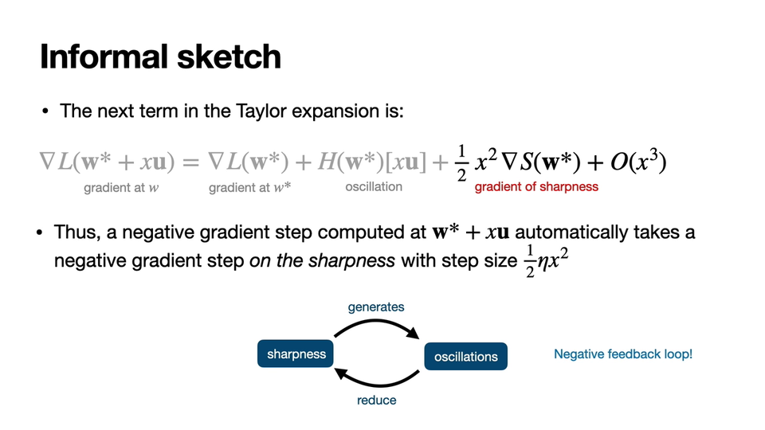

This creates a **negative feedback loop**:

1. High sharpness ($S > 2/\eta$) generates oscillations along the top eigenvector
2. Those oscillations automatically perform gradient descent on the sharpness, pushing it back down
3. The larger the oscillations, the stronger the stabilizing force (step size is proportional to $x^{2}$)

This feedback loop explains why gradient descent self-stabilizes at the edge of stability without any explicit mechanism to do so.

## Revisiting the dynamics

With this theory in hand, the empirical observations make perfect sense:

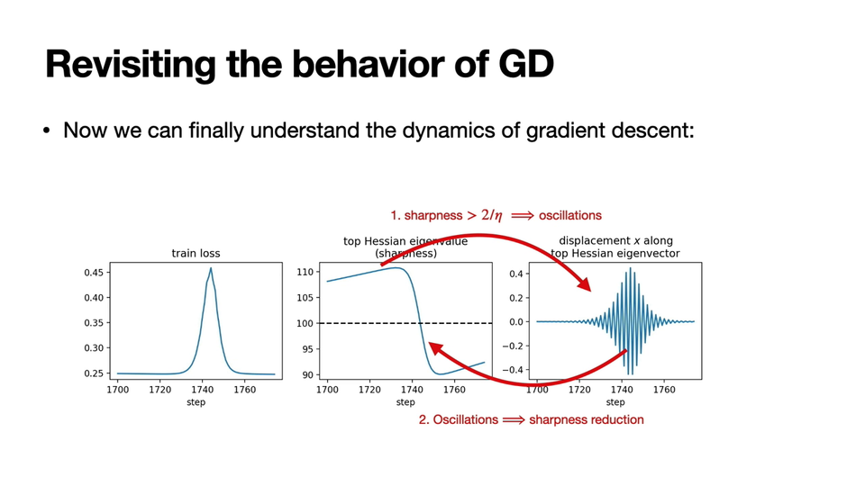

When sharpness exceeds $2/\eta$, oscillations grow exponentially (arrow 1). But those very oscillations implicitly reduce the sharpness (arrow 2). These two processes are coupled, and analyzing their interaction is the key to understanding gradient descent in deep learning.

The expectation-vs-reality picture captures the big picture elegantly:

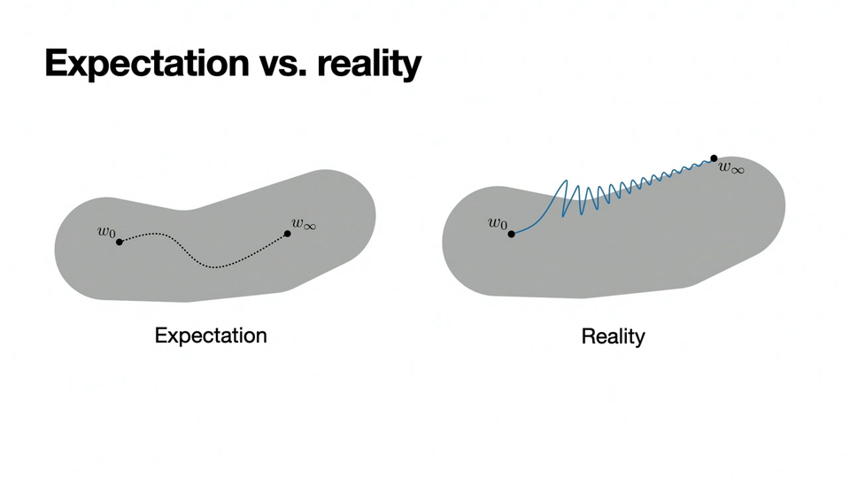

**Expectation**: gradient descent starts and remains inside the stable region, following a smooth path. **Reality**: gradient descent leaves the stable region, oscillates at the boundary, and implicitly projects out components of the gradient that would push it further outside. The trajectory rides the *edge* of the stable set.

## Broader implications and next steps

Cohen discussed several extensions and implications:

- **Other optimizers**: Similar edge-of-stability behavior has been shown for Adam and other full-batch optimizers.
- **Central flows**: Cohen's group has developed a framework called *central flows* for formally analyzing these dynamics (see [centralflows.github.io](http://centralflows.github.io)).
- **SGD**: The full-batch analysis is a special case of a more general picture that holds for stochastic gradient descent, with ongoing work to formalize this.
- **Learning Mechanics blog**: Cohen highlighted [learningmechanics.pub](../../raw/learningmechanics-pub.md), a new blog publishing long-form posts on the theory of deep learning, including a forthcoming visual guide to progressive sharpening and the edge of stability.

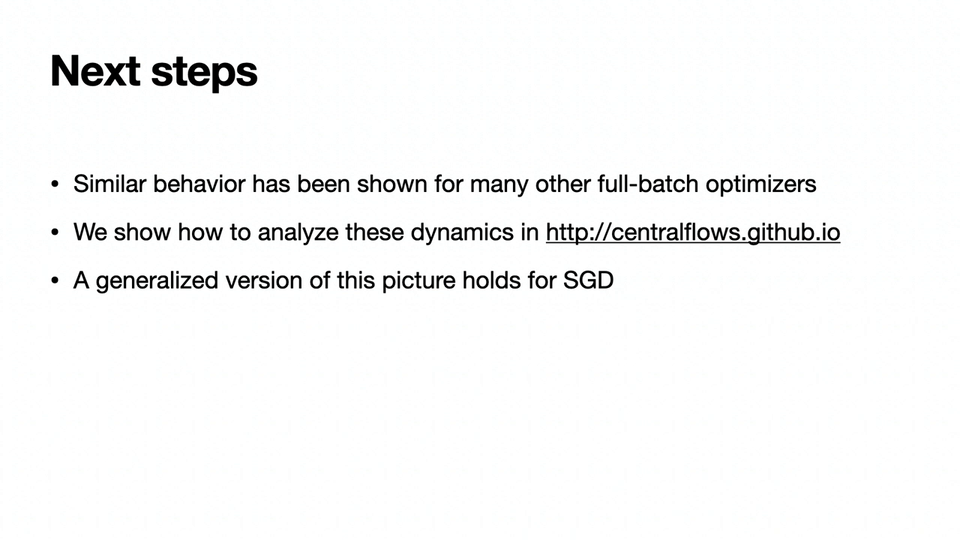

### On the value of understanding vs. algorithms

Cohen concluded with a thought-provoking reflection on the culture of ML research. He argued that the "platonic ideal" of an ML paper—identify an insight, prove a theorem, derive a SOTA algorithm—is often unattainable because *we don't yet know the right principles*. Practical algorithm design is not bottlenecked on applying known principles; the bottleneck is that the principles are unknown.

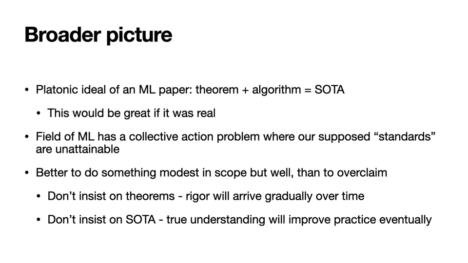

His prescription: focus on understanding the foundations now, with faith that true understanding will eventually yield practical gains. "Maybe someone will put this theory to good use next month, or maybe it will take years. Either way, we have faith that eventually, a true understanding will yield practical gains—and perhaps big ones."

## Key takeaways

1. **Gradient descent in deep learning operates at the edge of stability**: the sharpness (top Hessian eigenvalue) rises to $2/\eta$ and equilibrates there, rather than staying safely below it.

2. **This is universal**: the phenomenon appears across CNNs, ViTs, ResNets, LSTMs, Transformers, and Mamba—it is the typical behavior, not an edge case.

3. **Third-order Taylor expansion explains it**: the crucial missing ingredient from classical optimization theory is a third-order term in the gradient that equals the gradient of the sharpness.

4. **Self-stabilization via negative feedback**: oscillations along the top eigenvector automatically reduce the sharpness, creating a negative feedback loop that keeps gradient descent at the stability boundary.

5. **Loss spikes are benign**: the temporary loss increases during oscillation episodes are artifacts of displacement along a single direction; averaging consecutive iterates eliminates them.

6. **Understanding precedes algorithms**: the practical impact of these insights may take time, but investing in foundations is the path to long-term progress.

## Open questions

- **Why does sharpness increase during early training?** This robust empirical phenomenon remains theoretically unexplained.
- **How does stochasticity change the picture?** The full-batch analysis is clean, but practical training uses mini-batch SGD or Adam. Cohen mentioned ongoing work on this.
- **What about adaptive methods?** While edge-of-stability has been shown for Adam, the dynamics with learning rate adaptation (e.g., Muon) are less understood.
- **Does the stable region always contain good solutions?** Cohen acknowledged that for very high learning rates, one can construct tasks where no zero-loss solution exists within the stable region.
- **Connection to generalization?** The implicit regularization toward flatter minima (lower sharpness) may connect to generalization, but the link is not yet formalized.

## Sources

- [Sci4DL Workshop — ICLR 2026](../../raw/iclr-2026-workshop-sci4dl/README.md) — Workshop hosting Cohen's invited talk; full schedule and metadata
- [Sci4DL Transcript](../../raw/iclr-2026-workshop-sci4dl/transcript.md) — Full transcript of the talk and Q&A (timestamps 00:25:21–00:50:40)
- [Sci4DL Slides](../../raw/iclr-2026-workshop-sci4dl/slides/) — Presentation slides (slides 002–095 correspond to Cohen's talk)

### Key references cited in the talk

- Cohen, Kaur, Li, Kolter, Talwalkar. *Gradient Descent on Neural Networks Typically Occurs at the Edge of Stability.* ICLR 2021.
- Damian, Nichani, Lee. *Self-stabilization: the implicit bias of gradient descent at the edge of stability.* ICLR 2023.
- Cohen et al. *Understanding Optimization in Deep Learning with Central Flows.* 2025. [centralflows.github.io](http://centralflows.github.io)
- Simon, Kunin et al. [*There Will Be a Scientific Theory of Deep Learning.*](../papers/there-will-be-a-scientific-theory-of-deep-learning.md) 2026. ([arXiv](https://arxiv.org/abs/2604.21691))
- [Learning Mechanics](../../raw/learningmechanics-pub.md) — blog on the theory of deep learning, highlighted at the end of the talk ([learningmechanics.pub](https://learningmechanics.pub/))
