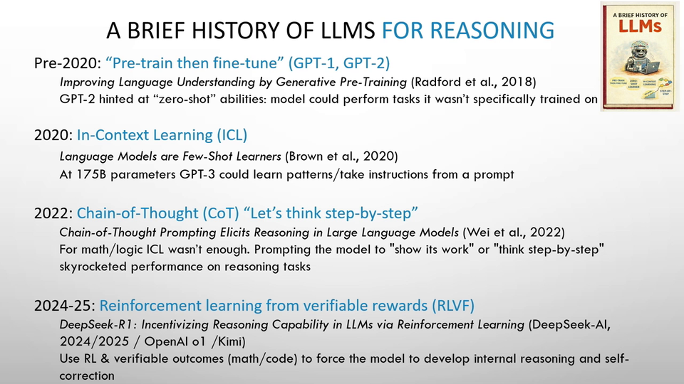
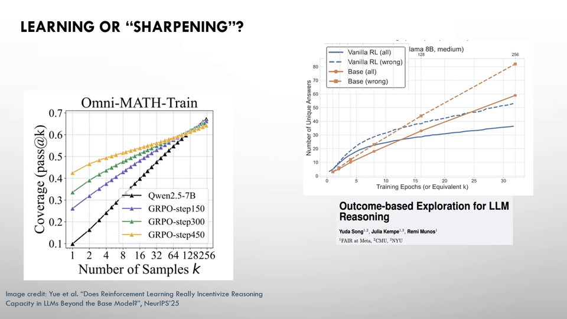
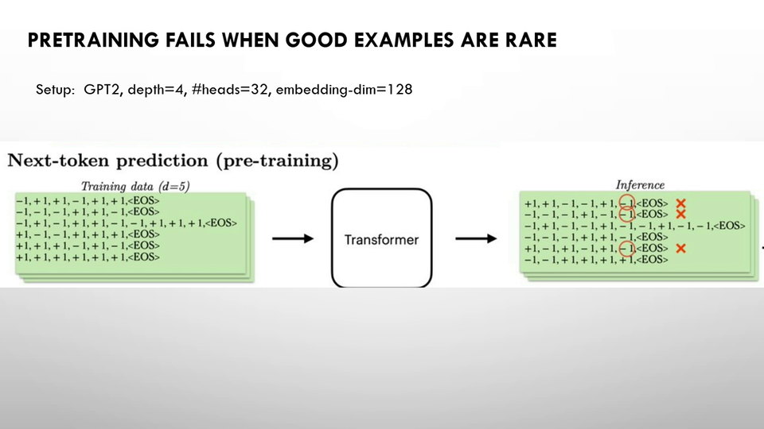
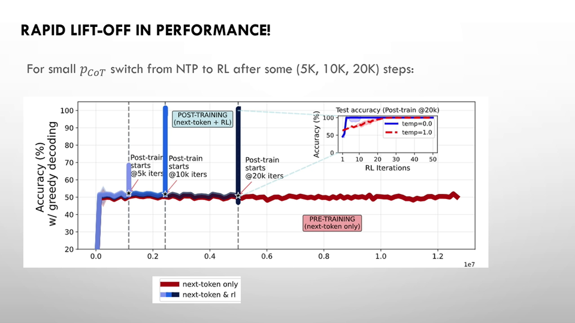
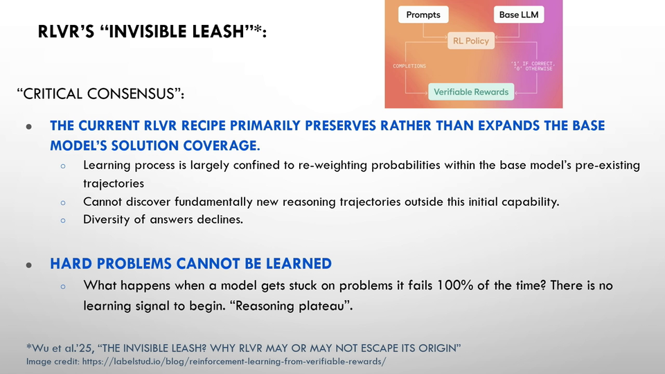
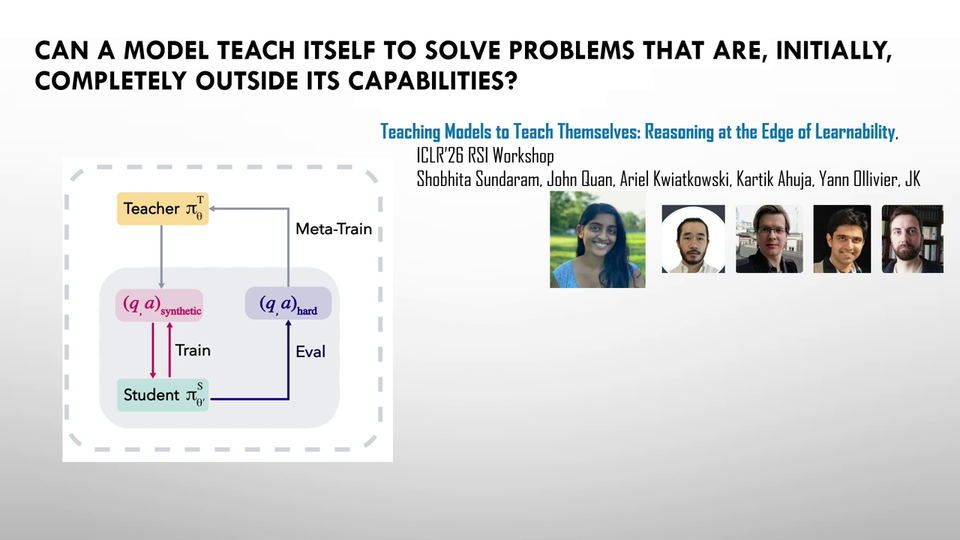
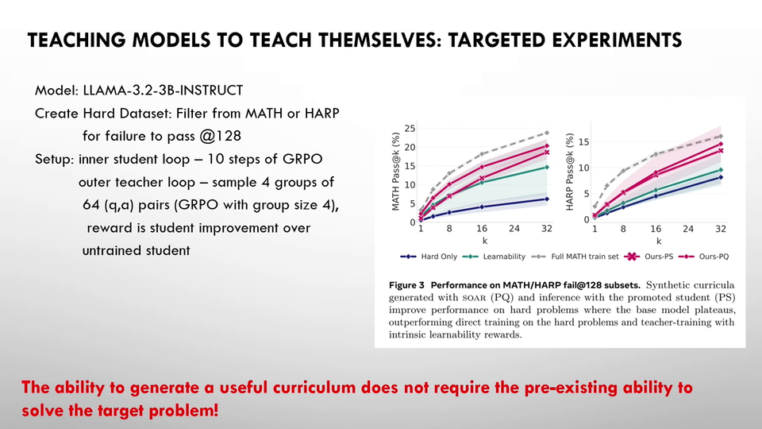

# Some Insights into LLM Reasoning: Julia Kempe on Why RL Unlocks Chain-of-Thought

## TL;DR

In her Sci4DL invited talk, Julia Kempe presents a clean mechanistic explanation for why reinforcement learning with verifiable rewards (RLVF) dramatically improves LLM reasoning. Using a controlled parity experiment with full theoretical backing, she shows that pretraining produces *length-calibrated* models that mirror the short-answer-dominated training distribution — even when they've already learned to reason via long chain-of-thought. RLVF simply up-samples the rare correct long demonstrations, shifting the model's policy in logarithmically few rounds. She then extends this to a self-play curriculum framework that tackles problems too hard for standard RLVF.

## Introduction: A Brief History of LLM Reasoning

Kempe — Silver Professor at NYU, currently directing the Foundations of Reasoning team at Meta FAIR in Paris — opens with a rapid timeline of the reasoning revolution. The story unfolds in five phases:

1. **Pre-2020: Pretrain → fine-tune.** GPT-2 era. Train a language model, then fine-tune for specific tasks.
2. **~2020: In-context learning.** The community discovers that pretrained LLMs are remarkable few-shot learners. Theoretical work on the mechanisms follows.
3. **2022: "Let's think step by step."** Chain-of-thought prompting — simply asking the model to reason — yields dramatic gains. A phenomenon begging for explanation.
4. **~2025: Reasoning models (o1, DeepSeek, Qwen).** A new post-training paradigm: RLVF (reinforcement learning with verifiable rewards), also called GRPO. Multiple rollouts, binary reward for correctness, reinforce the good ones. Chain-of-thought lengths increase during training.
5. **Now: Agentic self-improvement.** Multi-agent workflows, in-context RL, skill learning. "Fantastic new territory scientifically."

The central question: *What does RLVF actually do?* Is it teaching the model something new, or merely extracting capabilities already present in the pretrained weights?

## The Provocation: Is Intelligence Already in the Pretrained Model?

Kempe quotes Sébastien Bubeck: "The intelligence already exists in the pre-trained model — it's all about extracting it." She puts this up "slightly provocatively" because she doesn't fully believe it, but acknowledges there is "some truth" to it.

The evidence is suggestive. Several papers (including one of Kempe's) show that when you compare a base model's pass@k (take 128 rollouts, count if *any* is correct) with the RLVF-trained model's pass@1, the RLVF model sometimes becomes *worse* at pass@higher-k — less diverse, more concentrated. This has led to the claim that "RLVF does nothing but bring pass@k to pass@1."

A controlled study from Harvard reinforced this: they retrained a model from scratch with careful control over pretraining data and found that "RL algorithms consistently converge towards a dominant output distribution, amplifying patterns in the pre-training data."

But *how* does this amplification work, mechanistically? And *why* does it happen so fast?

## Part 1: The Parity Experiment — Isolating the Mechanism

### Setup

Kempe's first paper (with her student Nikos, plus Ilan and Karen) designs a controlled experiment that isolates the RLVF mechanism. The key insight is to model pretraining data as a *mixture* of two types:

- **Short demonstrations** (majority): a question and a direct answer, with no reasoning trace. Like most of the internet.
- **Long demonstrations** (rare fraction $p_{\text{CoT}}$): a question, followed by step-by-step partial computations, then an answer. Like high-quality worked examples.

The task is **parity** — compute the XOR of a bit string. Parity is a canonical hard problem in theoretical computer science: without intermediate computation, it requires exponential resources. But with a chain of partial parities (bit 1's parity, bits 1-2's parity, bits 1-2-3's parity, ...), it becomes trivially easy — just follow the chain.

A small transformer is trained via next-token prediction on this mixture.

### Key finding 1: Length calibration

The model remains **length-calibrated** after pretraining: if the training data contains 20% long demonstrations, the model outputs ~20% long responses and ~80% short ones. It faithfully mirrors the training distribution's length statistics.

This is crucial because under *greedy decoding*, if the training data has fewer than 1/3 long demonstrations, the model always outputs short answers — and short answers are essentially random guessing on parity (50% accuracy).

### Key finding 2: The model already knows how to reason

When the model *does* output a long chain-of-thought (in the probabilistic fraction of cases), it generalizes correctly to unseen bit strings "very quickly." The reasoning capability is learned during pretraining. But the model doesn't *choose* to use it often enough — it's drowned out by the dominant short-answer mode.

### Key finding 3: RL shifts the policy in log-few rounds

Now apply RLVF: do multiple rollouts, give positive reward for correct answers, negative for incorrect. Since long chain-of-thought answers are almost always correct (the model learned the chain), they get rewarded with probability ~1. Short answers are correct only ~50% of the time. So RL effectively **up-samples the long demonstrations** at each round.

The result: accuracy jumps to near-100% in $O(\log(1/p_{\text{CoT}}))$ rounds — *logarithmically few* in the fraction of good demonstrations. If only 2% of training data had chain-of-thought, RL needs roughly $\log(1/0.02) \approx 4$ rounds.

### The full theory

Remarkably, all of this — the length calibration, the 1/3 threshold, the logarithmic convergence — can be proven rigorously for an ensemble of linear transformers with a frozen layer. The theory matches the experimental observations on small transformers quantitatively.

### Validation in the wild

The same phenomenon holds for real pretrained LLMs. Using LLaMA-3B on GSM8K with a mixture of chain-of-thought and no-chain-of-thought demonstrations: SFT plateaus at ~50%, then switching to RL causes accuracy to "jump up like crazy" in logarithmically few steps. "Exactly the same mechanism for pretrained models."

### The mechanism, summarized

1. **During pretraining**: the model learns to reason from long demonstrations but remains length-calibrated (mirrors the training distribution). When it chooses to output a long chain, it generalizes well. When it chooses short, it fails.
2. **During RLVF**: because correctness correlates with length, RL up-samples the long chain-of-thought outputs. This shifts the model's policy to always use the reasoning capability it already had.
3. **Chain-of-thought lengthening is not about needing a scratchpad** — it comes from "the optimization pressure of this learning procedure."

So Bubeck's quote is *partially* right: the reasoning capability does exist in the pretrained model. But RLVF isn't just passively extracting — it's actively shifting the policy distribution toward the correct mode.

## Part 2: The Edge of Learnability — Self-Play Curriculum

### The hard-problem bottleneck

Standard RLVF requires at least one correct rollout to get a reward signal. For truly hard problems (Olympiad-level math, the Riemann hypothesis), none of the initial rollouts may be correct. "Kind of hopeless for hard problems when nothing is correct."

This is why progress has proceeded in steps — first GSM8K (grade school), then MATH (high school), then IMO — with handcrafted curricula at each stage. But what if we don't know the stepping stones?

### Teacher-student self-play

Kempe's second paper proposes letting the LLM design its own curriculum. The architecture:

1. **Split the model** into a teacher and a student (two copies).
2. The **teacher generates** question-answer pairs.
3. The **student does RLVF** on those questions (in batches).
4. Evaluate the student on the *hard* target dataset.
5. The **teacher gets rewarded** for the student's improvement (relative to a student without the teacher).

This is a bi-level optimization: the outer loop trains the teacher via RLVF; the inner loop trains the student.

### Results

"It worked. That's a short message. And it worked." The self-play curriculum outperforms the baseline across pass@k values, and — crucially — transfers out of domain. A curriculum trained on one math setting still helps on Olympiad Bench problems.

### Surprising findings

- **Intrinsic rewards fail**: alternatives to grounding the teacher's reward in actual student improvement (e.g., rewarding "appropriately hard" questions) are quickly reward-hacked by the LLM. "The LLM is so creative to hack the rewards. It's unbelievable."
- **Correct chains matter more than correct answers**: the stepping-stone questions generated by the teacher often had *wrong* final answers but *correct* chains of reasoning. "It was more often important to have a correct chain of reasoning rather than have the correct answers."

## Looking Forward: Can Models Transcend Human Annotation?

Kempe closes with the "big question": can LLMs bootstrap themselves beyond the best human? We're entering an era where "if you don't have a PhD, don't even work as an annotator... Nobel Prize, that's what they have as annotators now."

For constrained, verifiable domains — Go, code, arguably math — self-play has already transcended human performance. But where is the boundary? "What is it about self-play that will make it transcend when we don't have any more annotation because the human has been left behind?" She considers this "very interesting to understand" — and very much open.

### On doing science of reasoning

In the Q&A, asked how to do rigorous science on something as messy as LLM reasoning, Kempe offers practical advice: "First be an experimental physicist, then a theoretical physicist." The key is to **isolate the mechanism** — find the simplest setting where the phenomenon still occurs, understand the data completely, then build theory. "You have to just first make it less daunting and then you can attack it."

## Key Takeaways

1. **Pretraining teaches reasoning; RLVF teaches the model to *use* it.** The capability exists in pretrained weights, but the model is length-calibrated to the training distribution and won't deploy long chain-of-thought unless the policy is shifted.

2. **RLVF is a mode amplifier, not a teacher.** It up-samples the rare high-quality demonstrations from pretraining, converging in logarithmically few rounds — explaining why RL post-training is so sample-efficient.

3. **There is a critical threshold.** Below 1/3 long demonstrations in the pretraining mix (for the parity setting), greedy decoding never discovers chain-of-thought. Above it, the model naturally reasons. RLVF can recover reasoning even from very small fractions.

4. **Self-play curriculum learning can break through RLVF's hard-problem ceiling** by letting the model design its own stepping stones, with the teacher rewarded for genuine student improvement.

5. **Correct reasoning chains matter more than correct answers** for curriculum design — a finding with implications for synthetic data generation.

## Open Questions

- Does the 1/3 threshold generalize beyond parity? What determines the critical fraction for real pretraining distributions?
- Can the self-play curriculum approach scale to truly open-ended domains (science, engineering) where verification is expensive or impossible?
- Is there a theoretical limit to self-play improvement, analogous to the thermodynamic speed limit Welling described for distribution changes?
- How does the length-calibration phenomenon interact with the recent trend of long-context training? Does more pretraining on long documents shift the calibration naturally?
- What is the precise mechanism by which reward hacking emerges in intrinsic reward settings, and can it be formally characterized?

## Sources

- [Sci4DL Workshop — transcript and slides](../../raw/iclr-2026-workshop-sci4dl/README.md) — Full transcript of Kempe's talk (00:50:40–01:20:23) with 38 associated slides
- [Sci4DL Workshop summary](../summaries/iclr-2026-workshop-sci4dl.md) — Condensed summary of all workshop talks
- [Deep Learning Theory](../concepts/deep-learning-theory.md) — Broader context for scientific approaches to understanding deep learning
