# Marin: How Open Development and Scaling Recipes Are Changing Frontier AI

## TL;DR

Percy Liang's ICLR 2026 invited talk presents Marin, a frontier language model project built entirely in the open on GitHub. The talk argues that the ML community should shift from ad-hoc "YOLO" training runs to principled scaling recipes, embrace preregistration of experimental predictions, and adopt open development as the next evolution of open-source AI. Key technical contributions include a hyperball optimizer that stabilizes hyperparameters across scales and validated scaling laws that extrapolate 300× from small experiments.

## Introduction

When Percy Liang last gave an ICLR keynote in 2015, the field was grappling with whether deep learning could handle natural language understanding. By 2026, that question has been resoundingly answered — Claude can parse images into executable Python code, write C compilers in Rust, and explain its reasoning in natural language. So what's left?

Liang argues that the grand challenge for ICLR 2026 is not building bigger models, but understanding *algorithmic efficiency* — the core scientific question of machine learning. He draws a sharp distinction often blurred in practice: a machine learning researcher's job is to create better *algorithms* (measured by generalization), while a model developer's job is to produce better *models* (measured by end accuracy). The two are related by a simple equation: end accuracy = algorithmic efficiency × resources. Since most of us can't compete on resources, the path forward is better algorithms.

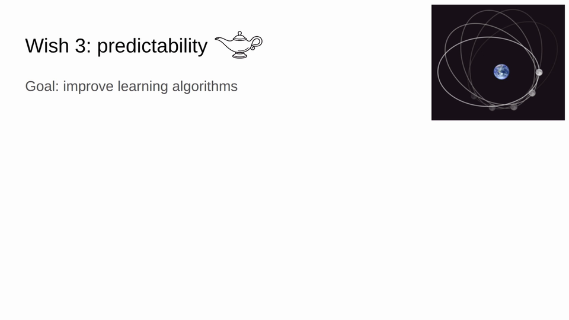

To advance algorithmic efficiency, Liang presents three wishes: **open development**, **algorithms at scale**, and **predictability**. The rest of the talk unfolds through the story of [Marin](../concepts/marin-project.md) — a project that attempts to realize all three.

## The dark ages: YOLO expeditions

Marin began in November 2024 with what Liang calls a "YOLO expedition" — an 8-billion-parameter training run where the team "didn't really know what we were doing" but committed to never turning back. They trained on the DCLM dataset, switched hardware mid-run, added Nemotron CC data partway through, and firefought problems as they arose.

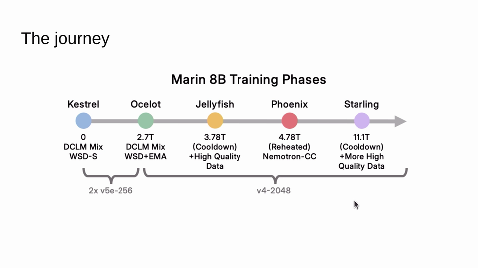

One memorable crisis: during learning rate cooldown, the training loss started *increasing* instead of decreasing. Investigation revealed that the LM head norm was blowing up. The fix — adding z-loss regularization — had to be applied mid-run since they couldn't restart. Despite the chaos, the resulting Marin 3.1 model beat LLaMA 3.1 on 14 of 19 benchmarks.

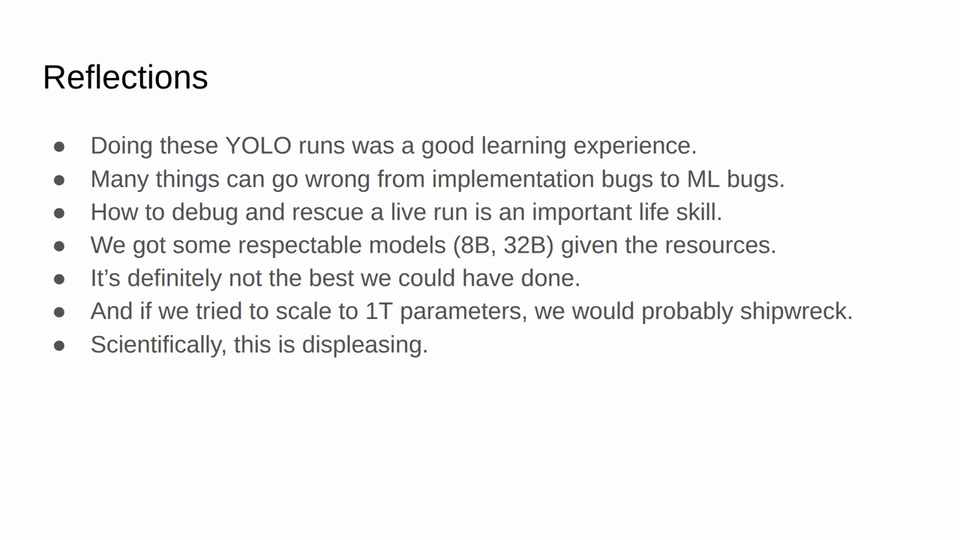

The second expedition targeted a 32B parameter model and brought new troubles. Loss spikes appeared frequently — the loss would spike up and then recover, "like getting sick and then recovering." Half of the experts they consulted said it would be fine; half said it wouldn't. The pessimists were right: eventually a "bad spike" hit that the model couldn't recover from.

The team tried gradient clipping, update skipping, and switching to the Muon optimizer — nothing worked. Finally, adding QK norm (normalizing query and key matrices by their Frobenius norm) stabilized training. Liang notes they had avoided this initially because "we were a little too proud" — the 8B run hadn't needed it. The resulting Marin 32B was briefly the best open-source base model, "for twenty days," until OLMo 3 and Nemotron overtook it.

The lesson: many things can go wrong in training — from implementation bugs to subtle ML issues — and knowing how to debug and rescue a live run is "an important life skill." But scientifically, YOLO runs are deeply unsatisfying.

## Enlightenment: scaling recipes

The talk's pivotal question: "Someone gives you $10^{25}$ FLOPs. What model would you train?"

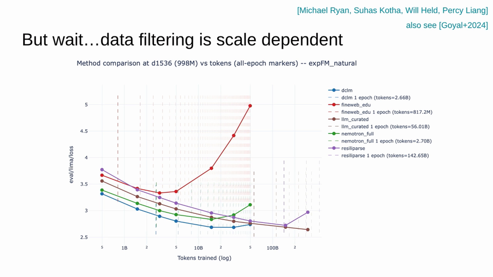

The problem is that a training run involves many interdependent hyperparameters — architecture shape, batch size, learning rate, schedule — and the design space is enormous. Even tuning just the learning rate can yield a 2× speedup. But you can't do hyperparameter sweeps at the scale of your target model. Therefore, you must choose configuration at small scale and trust that it transfers.

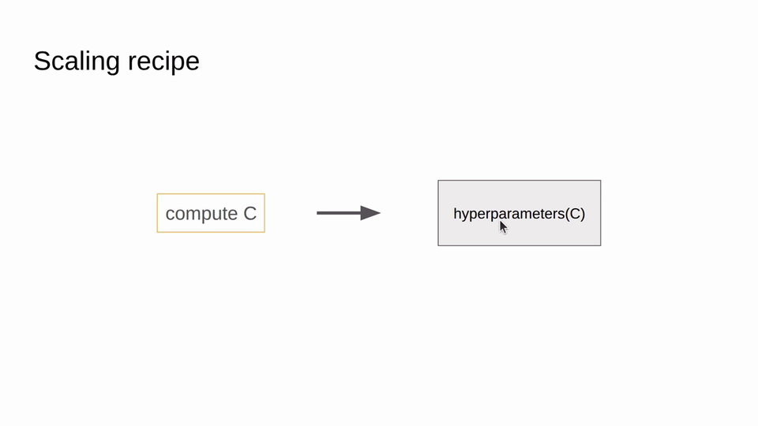

This is where Liang introduces the concept of a **scaling recipe**: not a fixed config file, but a *function* that maps compute budget to hyperparameter settings. "No matter what compute I give you, you should be able to tell me what hyperparameters to use." A scaling recipe is one level above an individual training run.

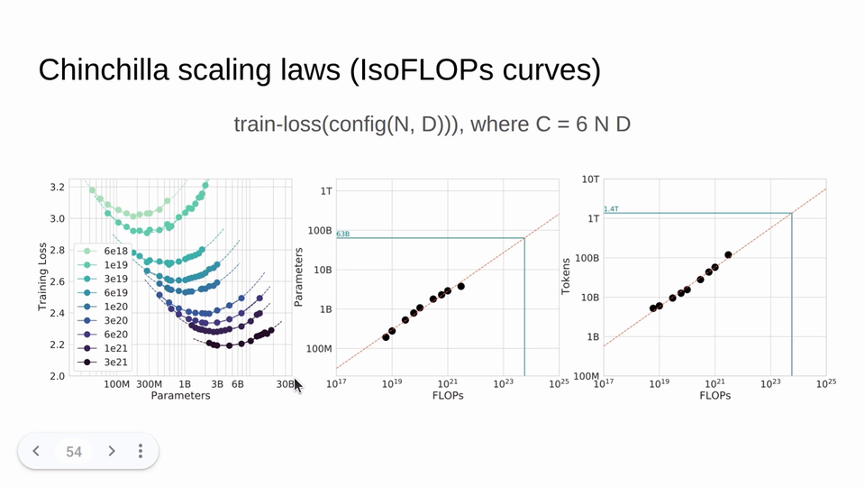

With a scaling recipe in hand, you can fit [scaling laws](../concepts/neural-scaling-laws.md) using the Chinchilla isoflop methodology: train models across a range of compute budgets, find the loss-optimal model size for each budget, then fit a power law for extrapolation.

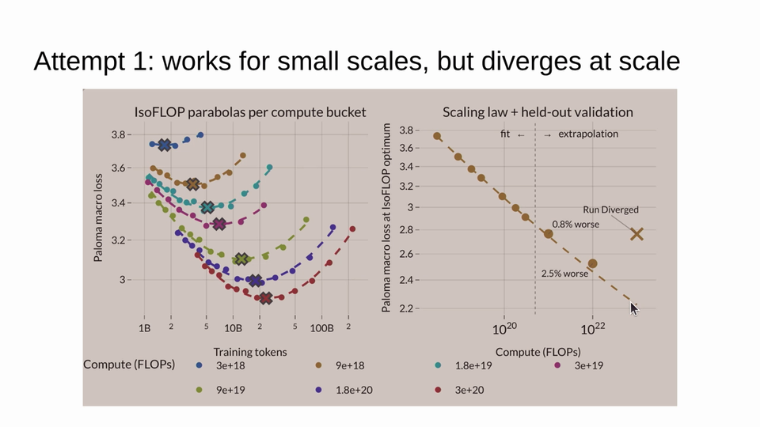

But Liang emphasizes a critical point: **scaling laws don't happen automatically**. The team's first scaling recipe produced clean isoflop curves at small scale, but at larger scales the training diverged with 2.5% error. "If you have a bad scaling recipe, you don't get a scaling law — or at least not a clean one."

## The hyperball optimizer

Two key fixes rescued the scaling recipe. The first was the **hyperball optimizer**, which normalizes weight updates onto a hypersphere. Standard Adam updates entangle the step direction with weight norm control — "if I tell you that $\lambda = 0.1$, I don't know what the norm of those weights are." The hyperball approach normalizes the update, takes a step, then normalizes again, so all weights lie on a hypersphere of controlled radius $r$.

The results were striking: 20–30% speedups even over Muon (compared to diminishing 10% gains with standard optimizers at scale). But arguably more important than raw speed was the *stability* — with the hyperball optimizer, optimal hyperparameters remained consistent across model scales, unlike Adam where the optimum shifts at each scale.

The second fix incorporated the observation that optimal learning rate decreases with token count, scaling as $n_{\text{tokens}}^{-0.3}$. Together with the hyperball optimizer, these changes produced the updated scaling recipe that would prove reliable at scale.

## Preregistration and 300× extrapolation

With a stable scaling recipe, the Marin team did something unusual for ML: they **preregistered** their predicted losses publicly on GitHub before completing their large-scale runs. At specific FLOP counts, they posted expected loss values derived from their small-scale isoflop curves.

The results validated the approach dramatically. Predictions made from models 300× smaller hit within 0.005 nats of the actual loss — no divergence, no 2% error. "This means you can experiment at 300 times smaller scale and still have a chance of predicting what's gonna happen at the larger scale." Using observational scaling laws, they also predicted downstream evaluation scores accurately.

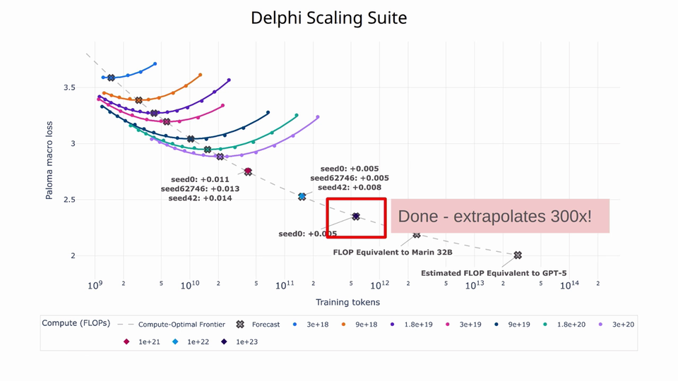

## Mixture-of-experts and beyond

With dense model scaling validated, the team extended to mixture-of-experts (MoE) architectures, achieving a 3.76× compute efficiency gain over dense models in their initial attempt, with an additional 1.5× from architecture iterations.

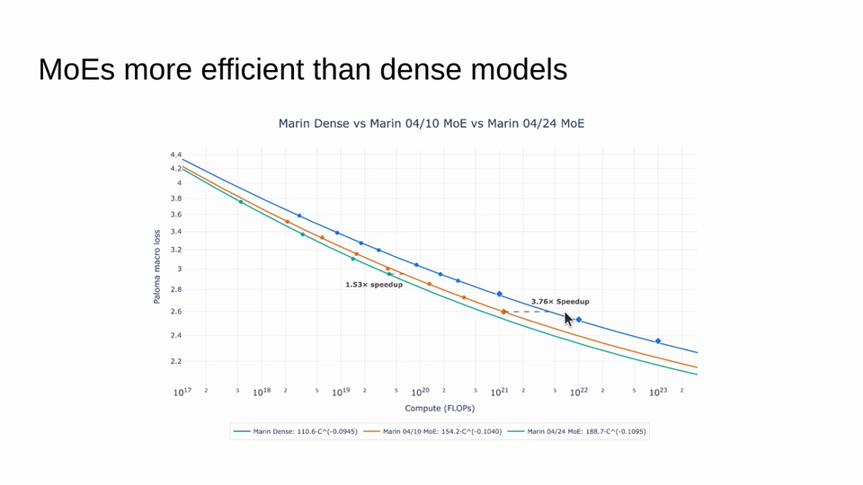

At the time of the talk, a 120-billion-parameter MoE model (16B active parameters) was in training at $10^{23}$ FLOPs, with a preregistered loss prediction of 2.52 pending verification. The same scaling infrastructure has been applied to audio modeling and DNA sequence modeling — different modalities that validate the generality of the approach.

On data, Marin has accumulated 18 trillion tokens from community-curated open datasets. Liang notes this is still less than DeepSeek v4's 32T tokens, and high-quality coding and agentic data remain gaps. Data mixture optimization is ongoing work, but preliminary results show their optimized curriculum outperforming standard baselines.

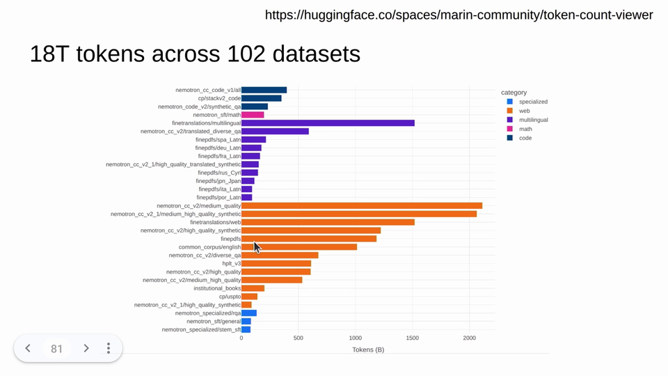

## Open development as the future of AI

The talk's final section argues that [open-source AI](../concepts/open-source-ai.md) should evolve beyond releasing artifacts to making the research *process* itself public. Liang presents a taxonomy: closed → open-weight → open-source → open development, and draws a parallel to software history — AI in 2026 is where software was in 1999, at the inflection point where open-source began to dominate.

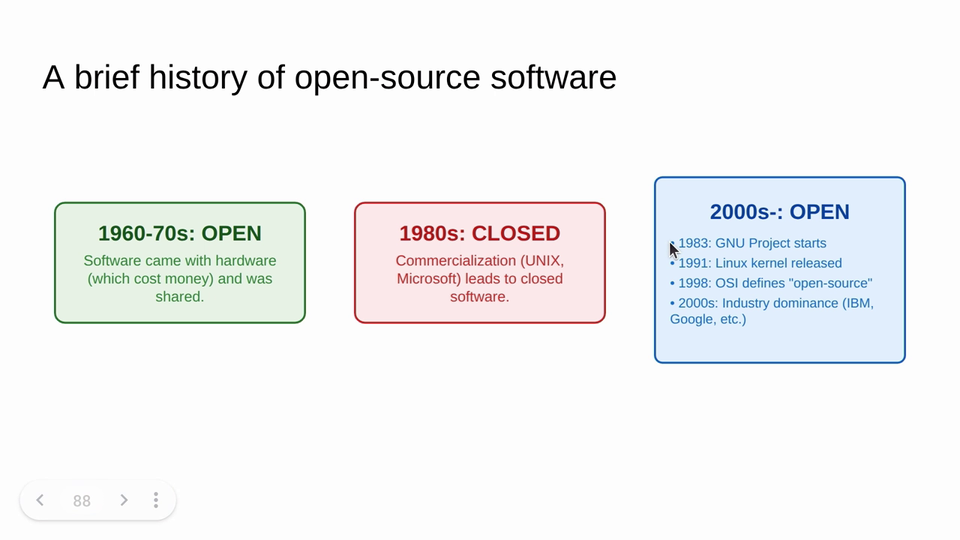

In open-source software, the development process has always been visible — "you can go to the Linux GitHub repo today and submit a pull request." But in AI, even "open-source" projects typically do closed development and then drop everything publicly. Marin's open development means every experiment, failure, and design rationale is visible on GitHub as it happens.

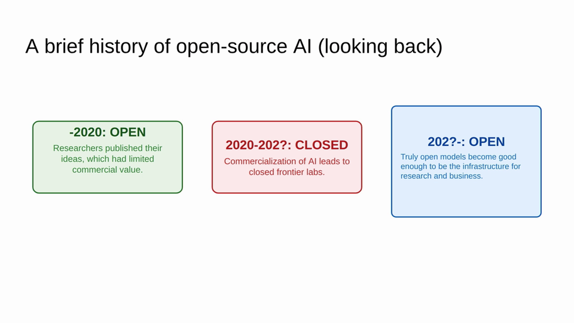

## Key takeaways

1. **Think in scaling recipes, not individual runs.** A scaling recipe is a function from compute budget to hyperparameters — it's one level above a config file and a prerequisite for reliable scaling laws.
2. **Scaling laws require engineering.** They don't emerge automatically; they require stable optimizers, principled hyperparameter transfer, and careful recipe design.
3. **The hyperball optimizer** normalizes weight updates onto a hypersphere, yielding 20–30% speedups and — more importantly — stable hyperparameters across scales.
4. **300× extrapolation is achievable.** Small-scale isoflop experiments can predict large-scale loss within 0.005 nats when paired with a sound scaling recipe.
5. **Preregister your predictions.** Publicly committing to expected outcomes before runs complete is both better science and a forcing function for developing reliable methods.
6. **Open development > open source.** Releasing code and weights is good; making the entire research process visible and contribution-friendly is better.
7. **Algorithmic efficiency is the grand challenge.** With efficiency doubling every ~8 months, there is substantial room for improvement that doesn't require massive compute budgets.

## Open questions

- **How far can 300× extrapolation go?** Liang acknowledges uncertainty — numeric stability issues at larger scales may limit extrapolation range.
- **Do scaling recipes compose?** When combining multiple architectural innovations (MoE + new optimizer + new data mix), do the individual scaling recipes stack or interfere?
- **Can the community scale open development?** If thousands of researchers contribute experiments, how should runs be prioritized and combined? Liang likens this to clinical trials but acknowledges it's an open meta-research problem.
- **Where are the missing tokens?** With 18T tokens accumulated but high-quality coding and agentic data still lacking, data curation remains a bottleneck for truly competitive open models.

## Sources

- [Marin invited talk — transcript + slides](../../raw/iclr-2026-invited-talk-marin-open-development-frontier-ai-talk/README.md) — Percy Liang's ICLR 2026 keynote; primary source for all content in this article
- [Neural Scaling Laws](../concepts/neural-scaling-laws.md) — concept page with theoretical grounding from Sci4DL workshop
- [Marin Project](../concepts/marin-project.md) — concept page with timeline and key technical details
- [Open-Source AI](../concepts/open-source-ai.md) — concept page covering the openness taxonomy
