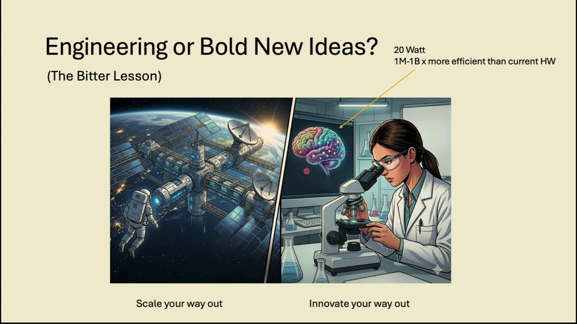
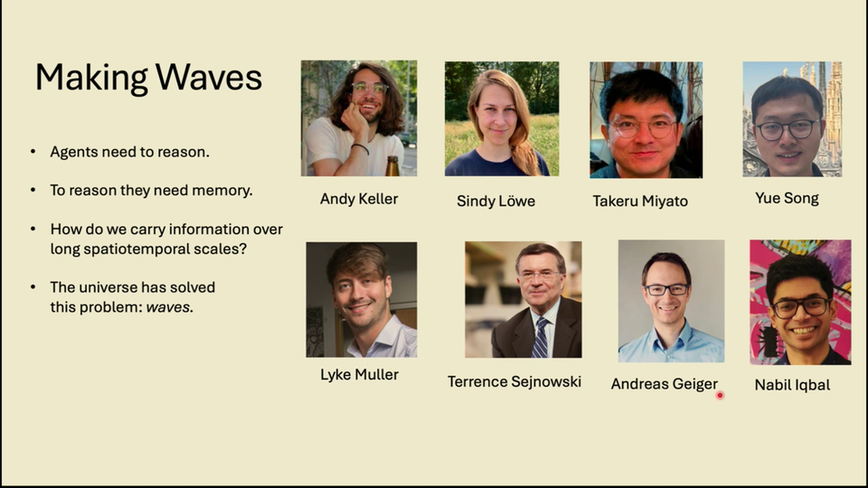
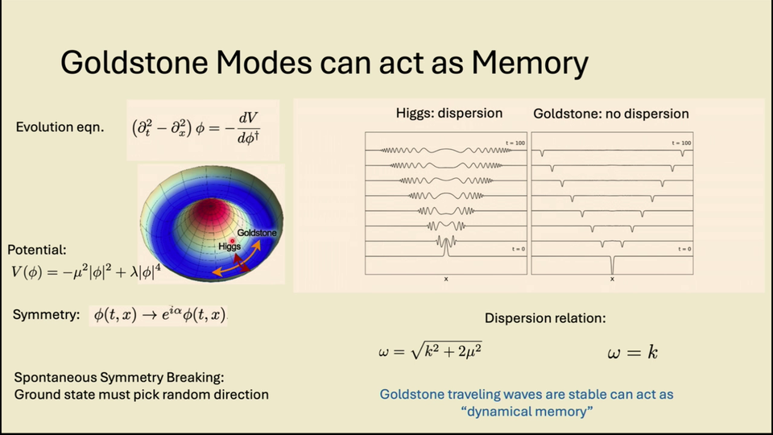
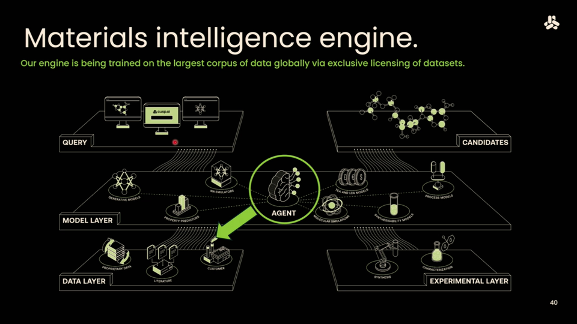
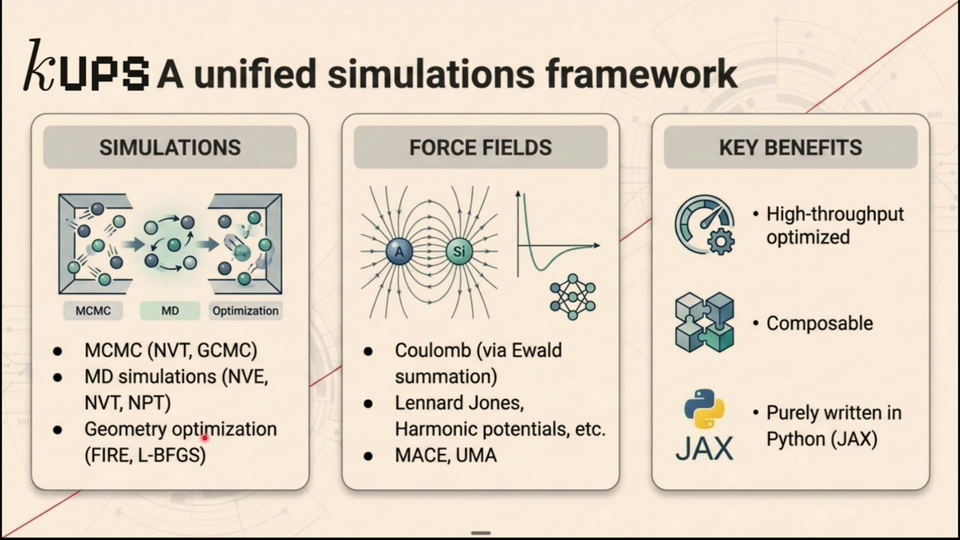

# From Physics to AI to Materials: Max Welling on Waves, Thermodynamics, and the Responsibility of Building Powerful Tools

## TL;DR

In his ICLR 2026 keynote, Max Welling argues that physics offers deep structural insights that can shift paradigms in AI — not just incremental improvements. He presents three interconnected themes: (1) [spontaneous symmetry breaking](../concepts/spontaneous-symmetry-breaking.md) as a mechanism for wave-based memory in neural networks, (2) the mathematical identity between [stochastic thermodynamics](../concepts/stochastic-thermodynamics.md) and probabilistic AI, enabling zero-variance free energy estimation, and (3) the deployment of these ideas through [CuspAI](../concepts/ai-for-materials.md) to tackle climate and materials challenges. He closes with a call for the ML community to make conscious choices about the technologies they build.

## Introduction: Innovate Your Way Out

Welling opens with a provocation. He was a keynote speaker at the first ICLR in 2013, when the audience was "50 to 100 people." Now, standing before thousands, he observes that the field's explosive growth has changed how science is done. Modern research is fast, incremental, and highly coupled — "everybody wants to work on LLMs" — and the side effect is that "principled, strange new ideas are suppressed... because you cannot produce the bold numbers."

He frames two paths forward. The first is the "bitter lesson" — scale your way out — which is predictable and companies like it. The second is to *innovate* your way out: "think hard about the problem, shift the paradigm." He points to the human brain, which operates at roughly 20 watts — a million to a billion times more efficient than current hardware. "If we figure out how the brain works, why would we shoot data centers into space?"

This sets the stage for the talk's central argument: physics principles, not just engineering scale, can yield fundamental advances in AI.

## Part 1: Making Waves — Spontaneous Symmetry Breaking in Neural Networks

### Ten years of equivariance

Welling begins by celebrating a decade since his student Taco Cohen introduced [group equivariant convolutional neural networks](../concepts/equivariant-networks.md) in 2016. The idea — that a network's outputs should transform predictably under symmetry transformations of its inputs — has since become foundational, especially in [AI for science](../concepts/ai-for-materials.md). Equivariant graph neural networks now power machine learning interatomic potentials for molecular simulation, and equivariant generative models can create 3D molecular structures that respect physical symmetries. Maurice Weiler's textbook, produced from Welling's group, provides the comprehensive treatment.

### From hardwired symmetry to spontaneous breaking

But Welling's "bold new proposal — without bold numbers" goes further. The question: *how do we build systems that naturally hold things in memory over long spatiotemporal scales?* His answer: the universe solved this with waves. Electromagnetic waves carry information across cosmic distances. The brain, we now know from multi-electrode recordings, uses traveling waves for information propagation.

The key physics concept is [spontaneous symmetry breaking](../concepts/spontaneous-symmetry-breaking.md) (SSB). In a live demonstration with a stick, Welling illustrates the distinction between explicit and spontaneous breaking. Push the stick sideways — that's explicit, you chose the direction. Push straight down on a symmetric stick — it falls in a random direction. The symmetry is broken, but not by any external choice. The natural stable state has lower symmetry than the governing equations.

When a continuous symmetry is spontaneously broken, two types of excitations emerge:

- **Higgs modes**: oscillations that require energy and exhibit dispersion — "I have to put energy in that oscillation." Information mixes across frequencies and is lost.
- **Goldstone modes**: oscillations along the "flat" directions that propagate without dispersion. These preserve their shape — and hence information — over arbitrary distances.

### Capsule networks at the edge of chaos

Welling's proposal is to engineer neural networks with internal symmetries that can spontaneously break. Drawing on Hinton's capsule idea, each neuron carries an internal degree of freedom — a vector on a sphere, a "spin." The network is constructed so that rotating all input spins by a common phase rotates all downstream spins by the same amount (equivariance). When the variance of random initialization crosses a critical threshold, the system undergoes a phase transition: internal sphere representations go from collapsing (ordered phase) to expanding (chaotic phase). At the boundary — the *edge of chaos* — information propagates through hundreds or thousands of layers via Goldstone-mode traveling waves.

"I Googled 'is the brain on the edge of chaos' and since it's by the University of Cambridge, it must be true," Welling quips. But the connection is genuine: neuroscience work by Terry Sejnowski and Lyle Muller, with whom Welling has collaborated, shows that multi-electrode recordings reveal traveling waves throughout the brain. A Nature Perspectives paper on the relationship between neuroscience, machine learning, and symmetries is forthcoming.

Preliminary results show that RNNs with internal sphere structure — symmetry-equipped RNNs — outperform standard RNNs and GRUs on memory-intensive tasks (permuted MNIST, copy task, adding task) with fewer parameters. When visualized, the internal channels show oscillating vectors that "spin around in this space," holding information in their phase dynamics rather than in static activations.

## Part 2: The Thermodynamics of AI

### Time-reversal symmetry and entropy

Welling pivots to his second physics theme. At the microscopic level, physics is time-reversal symmetric: molecules bouncing around look the same forward or backward. But macroscopic systems break this symmetry — "I cannot go back in time and get myself more time for this talk." This breaking produces entropy, and the mathematics describing it are "virtually identical" to probabilistic AI.

The unifying equation is the Markov chain: a map that loses information. Run it long enough and you've forgotten the initial state entirely. Welling introduces **Crooks' fluctuation theorem**, which makes this precise: the ratio of forward and time-reversed path probabilities equals $e^{\sigma_{\text{tot}}}$, the exponential of total entropy production. This is exact, not an approximation.

### The Jarzynski equality and free energy

From Crooks' theorem, Welling derives the **Jarzynski equality**: $\langle e^{-W} \rangle = e^{-\Delta F}$. By averaging the exponential of negative work over many non-equilibrium trajectories, you recover the equilibrium free energy difference. He notes with delight that Radford Neal independently discovered the equivalent result as annealed importance sampling: "Isn't that beautiful? These two things got independently discovered from two different fields."

A recent result tightens the connection further: dissipated work is lower-bounded by the squared 2-Wasserstein distance between initial and final distributions, divided by time: $W_{\text{diss}} \geq \mathcal{W}_2^2(p_0, p_T) / T$. Welling argues this implies a fundamental limit to superintelligence: "If I have a thought, I need to change the distribution of my internal neurons. If I want to think fast, I'm going to pay more energy."

### A dictionary between ML and physics

Welling presents a systematic correspondence between machine learning and [stochastic thermodynamics](../concepts/stochastic-thermodynamics.md):

| Machine Learning | Stochastic Thermodynamics |
|:---|:---|
| Variational free energy / ELBO | Thermodynamic free energy |
| E-step (minimize over $q$) | Relaxation (entropy/heat generation) |
| M-step (learning) | Performing work on the system |
| Diffusion models | Non-equilibrium thermodynamic processes |
| Stochastic normalizing flows | Escorted free energy estimation |
| Optimal transport CNFs | Counter-diabatic driving |
| Annealed importance sampling | Jarzynski equality |

He reminds the audience that the original diffusion model paper (Sohl-Dickstein et al.) was titled "Deep Unsupervised Learning Using *Non-equilibrium Thermodynamics*" — the connection was explicit from the start. A book co-authored with Siri Lou and Lars Holdijk systematically develops these parallels.

### Application: zero-variance free energy estimation

The practical payoff comes in drug discovery. Computing the binding free energy — how strongly a drug-like molecule binds to a protein pocket — is notoriously expensive. Standard molecular dynamics simulations "wait forever." Welling's approach: train a flow matching model to drive molecular configurations between unbound and bound states, then use the Jarzynski equality to compute $\Delta F$ from the work done along each trajectory.

The naive estimator has prohibitive variance (paths with large work dominate the exponential average). But the **generalized Jarzynski equality** with optimal transport paths achieves theoretically *zero* variance — "that's amazing. Zero variance." The key is solving the optimal transport problem between initial and final distributions, yielding straight-line paths with minimal dissipation.

## Part 3: From Foundations to Impact — CuspAI

### Maxwell's demon and the materials discovery loop

Welling frames his startup [CuspAI](../concepts/ai-for-materials.md) through the lens of Maxwell's demon. In the first design iteration, expensive simulations produce information (entropy). But a demon — here, the AI system — stores that information in a database, distills it into neural network weights, and uses it to accelerate subsequent iterations. Machine learning interatomic potentials trained on previous simulation data make the next round cheaper. "That is literally Maxwell's demon."

### A search engine for materials

CuspAI operates as "a search engine — except it searches not over existing documents but generates new materials." The workflow:

1. A user provides a natural-language prompt specifying desired material properties and constraints
2. A CuspAI agent orchestrates the computation: database lookup → generative design → multi-scale simulation → experimental validation → refinement
3. Results go back to the chemist, who refines the prompt

### Open-source JAX molecular dynamics toolkit

Welling announces the open-source release of a new JAX-based molecular dynamics toolkit, developed by Jonas Köhler and Nicholas Gao in collaboration with NVIDIA. Key features:

- **GPU-native and batched**: Python-first, runs natively on GPUs/TPUs, built around batching for maximum hardware utilization
- **Compile-in ML force fields**: any machine learning force field can be compiled directly into JAX and used within the MD simulator
- **Full simulation stack**: molecular dynamics, canonical Monte Carlo, geometry optimization, Coulomb interactions (Ewald summation), Lennard-Jones potentials

He demonstrates three applications: computing CO$_2$ adsorption isotherms in metal-organic frameworks for carbon capture, batch relaxation of frameworks using the MACE force field compiled from PyTorch into JAX, and simulating proton hopping in sulfuric acid — reproducing radial distribution functions more accurately than some DFT calculations.

## Epilogue: We Are All Oppenheimers

Welling closes on a serious note. "We are all Oppenheimers," he says — developers of a powerful dual-use technology. The comparison is deliberate: like nuclear physics, AI capabilities can serve both beneficial and harmful ends. He does not prescribe what to work on, but asks the audience to "make conscious choices... and do not look away from the problem." It is a fitting coda to a talk that began by arguing for paradigm-shifting ideas over incremental engineering — the responsibility to innovate well includes the responsibility to innovate wisely.

## Key Takeaways

1. **Spontaneous symmetry breaking may be fundamental to neural computation.** Goldstone modes — zero-energy waves arising from broken continuous symmetries — provide a natural mechanism for long-range memory without explicit memory modules. Preliminary results with symmetry-equipped RNNs are promising.

2. **Stochastic thermodynamics and probabilistic AI share identical mathematics.** The Crooks fluctuation theorem, Jarzynski equality, and optimal transport theory provide tools that transfer directly between fields — including zero-variance free energy estimators for drug discovery.

3. **The speed of thought has a thermodynamic cost.** The Wasserstein bound on dissipated work implies that faster distribution changes (thoughts) require more energy — a fundamental limit that applies to both biological and artificial intelligence.

4. **Physics-informed AI is reaching deployment scale.** CuspAI's materials discovery platform and the new open-source JAX MD toolkit demonstrate that foundational physics insights can yield practical tools for climate, energy, and drug discovery.

5. **The ML community must engage with the dual-use nature of its work.** "Do not look away" — paradigm-shifting ideas require paradigm-shifting responsibility.

## Open Questions

- Can symmetry-breaking capsule networks scale to large language model regimes, or are they fundamentally suited to different task types (spatial, memory-intensive)?
- What is the practical gap between the theoretical zero-variance Jarzynski estimator and real-world drug binding calculations?
- How close are current ML force fields to replacing DFT across the periodic table, not just for organic molecules?
- Is there a precise formulation of the "edge of chaos" conjecture for transformers, or does it apply primarily to recurrent architectures?
- Can the thermodynamic speed limit on thought ($W_{\text{diss}} \geq \mathcal{W}_2^2 / T$) be made quantitatively predictive for neural network training or inference?

## Sources

- [Max Welling invited talk — transcript and slides](../../raw/iclr-2026-invited-talk-from-physics-to-ai-to-materials-talk/README.md) — Primary source: full 59-minute transcript with 67 slides from ICLR 2026
- [Summary: From Physics to AI to Materials](../summaries/iclr-2026-invited-talk-welling.md) — Condensed summary of the three-part talk
- [Spontaneous Symmetry Breaking](../concepts/spontaneous-symmetry-breaking.md) — Concept page on SSB and Goldstone modes in neural networks
- [Equivariant Networks](../concepts/equivariant-networks.md) — Ten years of symmetry in deep learning
- [Stochastic Thermodynamics](../concepts/stochastic-thermodynamics.md) — ML–physics dictionary and free energy methods
- [AI for Materials](../concepts/ai-for-materials.md) — CuspAI platform and JAX MD toolkit
