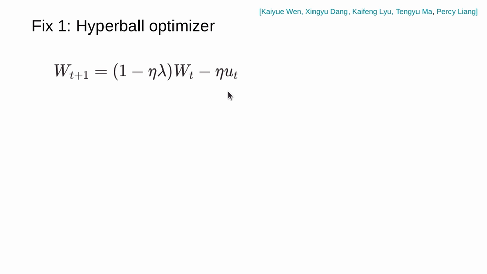
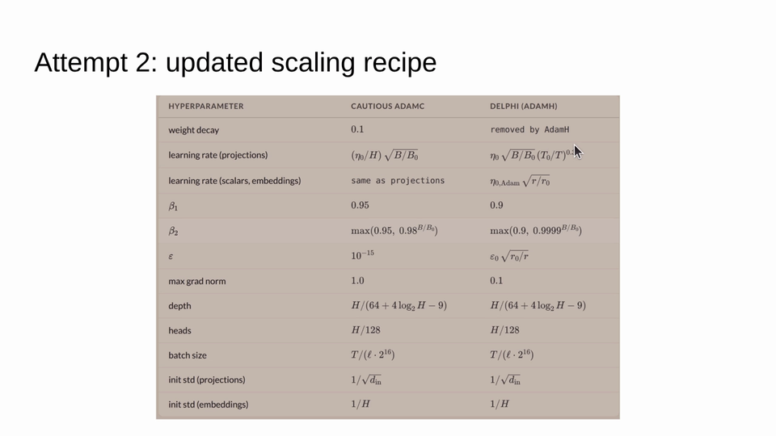

# Hyperball Optimizer

The hyperball optimizer is a meta-optimizer that constrains each weight matrix to a fixed Frobenius norm — geometrically, projecting parameters onto a hypersphere (a "hyperball") after each update. By decoupling the *direction* of the update from the *scale* of the weights, it eliminates the entanglement between step size and weight norm that plagues standard optimizers like Adam.

## Key ideas

- **Normalize-update-normalize**: The update rule is conceptually simple: (1) normalize the weight matrix to unit Frobenius norm, (2) take a gradient step, (3) normalize again. All weights live on a hypersphere of controlled radius $r$.
- **Weight decay becomes a no-op**: On the Frobenius sphere, standard decoupled weight decay has no first-order effect — the projection already controls the norm. This eliminates an entire hyperparameter from the search space.
- **Stable hyperparameter transfer**: The core practical benefit. With Adam/AdamW, the optimal learning rate shifts at each model scale, making scaling recipes unreliable. With the hyperball optimizer, optimal hyperparameters remain consistent across model widths and depths, enabling simple functional scaling recipes.
- **20–30% speedups over Muon**: In the Marin project's experiments, the hyperball optimizer delivered persistent speedups that did *not* diminish at larger scales — unlike the ~10% gains from other optimizer improvements which tend to shrink.
- **Learning rate–token scaling**: Combined with the observation that optimal learning rate decreases as $n_{\text{tokens}}^{-0.3}$ (the "magic exponent" ≈ 0.32), the hyperball optimizer enables 300× extrapolation of scaling laws from small experiments.

## Geometric intuition

Standard Adam updates entangle direction and magnitude: "if I tell you that $\lambda = 0.1$, I don't know what the norm of those weights are" (Percy Liang, ICLR 2026). The hyperball approach separates these concerns — the radius $r$ controls norm, the optimizer controls direction on the sphere. This is analogous to how spherical coordinates separate radial and angular motion.

## Hyperball paper

The formal details are developed in [Wen et al. (2025)](../papers/hyperp-hypersphere-scaling.md), "Fantastic Pretraining Optimizers and Where to Find Them 2.1: Hyperball Optimization" — a follow-up to the original benchmarking study ([arXiv:2509.02046](https://arxiv.org/abs/2509.02046)) which showed that optimizer gains over AdamW diminish at scale. The hyperball extension addresses this by removing weight norm from the optimization landscape entirely, yielding persistent speedups. A companion blog post ([Part 2.2](https://whenwen.github.io/wd_blog/public/weight-decay-part-2.html)) provides the theoretical motivation via weight norm theory.

## HyperP: Full transfer framework

[Ren et al. (2026)](../papers/hyperp-hypersphere-parameterization.md) extend the hyperball approach into **HyperP** (Hypersphere Parameterization), the first complete framework for transferring a single optimal learning rate across width, depth, training tokens, and MoE granularity under Frobenius-sphere constraint. Key results:

- **Formal proof** that weight decay is a first-order no-op on the Frobenius sphere (Theorem 1)
- **Depth-µP still required**: Disproves the original MuonH paper's claim of inherent depth transferability
- **Data scaling**: Optimal LR follows $\eta^* \propto T^{-0.32}$ — same "magic exponent" as for AdamW
- **1.58× compute efficiency** over Muon baseline at $6 \times 10^{21}$ FLOPs, growing monotonically with scale
- **SqrtGate**: A $\sqrt{g_i}$ gating mechanism for MoE that preserves output RMS across granularities

## Related work

- **Muon optimizer**: A matrix-based optimizer that the hyperball approach extends. Muon orthogonalizes gradients; hyperball adds norm control.
- **µP (Maximal Update Parameterization)**: An earlier approach to hyperparameter transfer for first-order optimizers.
- **Fantastic Pretraining Optimizers** (Wen, Hall, Ma, Liang, 2025): The original benchmarking study ([arXiv:2509.02046](https://arxiv.org/abs/2509.02046)) of 10 optimizers across scales, showing that matrix-based optimizers (Muon, SOAP, Kron) outperform scalar ones at small scale but gains diminish — motivating the hyperball approach.

## Sources

- [Percy Liang ICLR 2026 invited talk](../../raw/iclr-2026-invited-talk-marin-open-development-frontier-ai-talk/README.md) — Introduction and intuition for the hyperball optimizer in the context of Marin scaling recipes
- [Hyperball Optimization paper](../papers/hyperp-hypersphere-scaling.md) — Wen, Dang, Lyu, Ma, Liang (2025): formal details of the hyperball meta-optimizer
- [HyperP paper](../papers/hyperp-hypersphere-parameterization.md) — Ren et al. (2026): full transfer framework across width, depth, tokens, and MoE granularity
- [Hyperball Optimization blog (Part 2.1)](../../raw/fantastic-pretraining-optimizers-hyperball.md) — Full blog post with experiments, mechanism, and related methods
- [Weight Norm Theory blog (Part 2.2)](../../raw/fantastic-pretraining-optimizers-weight-norm-theory.md) — Theoretical analysis of weight norm dynamics

## Related concepts

- [Neural Scaling Laws](neural-scaling-laws.md) — The hyperball optimizer enables reliable isoflop scaling
- [Marin Project](marin-project.md) — The project where the hyperball optimizer was developed and validated
